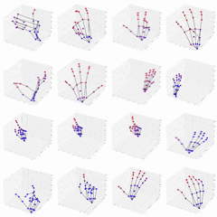

# 🎨 SKETCH  
This is the official implementation of  **"Doodle to Detect: A Goofy but Powerful Approach to Skeleton-based Hand Gesture Recognition".**

<p align="left">
  <a href="#"></a>
  <a href="#"></a>
</p>

## 📑 Table of Contents
- [Overview](#overview)
- [Development Progress](#development-progress)
- [Results](#results)
- [Installation](#installation)
- [Community & Contribution](#community--contribution)
- [Citation](#citation)
- [License](#license)
- [Contact](#contact)

---

## 🧠 Overview <a id="overview"></a>
SKETCH is a novel skeleton-based hand gesture recognition framework that directly transforms raw 4D skeleton sequences into interpretable visual graph representations. It introduces a learnable Dynamic Range Embedding (DRE) to preserve motion magnitudes and applies per-window normalization for robustness to viewpoint and body variations. Leveraging pre-trained vision backbones, SKETCH achieves state-of-the-art accuracy and generalization on SHREC’19 and SHREC’22 benchmarks.

<p align="center">
  
</p>
<p align="center"><em>Figure 1. Overall architecture of the SKETCH.</em></p>

---

## 🛠️ Development Progress <a id="development-progress"></a>
### Core Implementation  
- [x] Demo script
- [ ] Release pretrained model (SHREC'22)  
- [ ] Add training pipeline (SHREC'22)  
- [ ] Release pretrained model (SHREC'19)  
- [ ] Add training pipeline (SHREC'19)  

---

## 📊 Results  <a id="results"></a>

<p align="left">
  
</p>
<p align="left"><em>Figure 2. Visualization of joint-level attention for gestures in the SHREC’22 dataset.</em></p>

<p align="center">
  
</p>
<p align="center"><em>Figure 3. Visualization of gesture-level attention.</em></p>


### Comparison on SHREC’19  
| **Method** | **DR↑** | **FP↓** | **Time (s)** | **FPS** | **JCD** | **FD** | **Adj** | **Ref** | **Plot** |
|-------------|---------|---------|---------------|---------|----------|----------|----------|----------|----------|
| PSUMNet | 0.64 | 0.22 | 0.0250 | 40 | ✓ | ✓ |  |  |  |
| MS-G3D | 0.69 | 0.25 | 0.0303 | 33 | ✓ |  |  |  |  |
| SeS-GCN | 0.75 | 0.12 | 0.0020 | 500 |  |  | ✓ |  |  |
| SW 3-cent | 0.76 | 0.19 | 0.0030 | 333 |  | ✓ |  | ✓ |  |
| DSTA | 0.81 | 0.08 | 0.0088 | 114 | ✓ |  |  |  |  |
| DG-STA | 0.81 | 0.07 | 0.0042 | 238 |  |  | ✓ |  |  |
| DDNet | 0.82 | 0.10 | 0.0022 | 455 | ✓ | ✓ |  |  |  |
| uDeepGRU | 0.85 | 0.10 | 0.0030 | 333 |  | ✓ |  | ✓ |  |
| OO-dMVMT | 0.88 | 0.05 | 0.0058 | 172 | ✓ | ✓ |  |  |  |
| DS-GCN | 0.80 | 0.05 | - | - |  |  | ✓ | ✓ |  |
| BlockGCN | 0.83 | 0.04 | - | - |  | ✓ | ✓ | ✓ |  |
| ProtoGCN | 0.86 | 0.05 | 0.0334 | 30 |  |  | ✓ | ✓ |  |
| **SKETCH (V-L-16-384)** | 0.90 | 0.03 | 0.0176 | 57 |  |  |  |  | ✓ |
| **SKETCH (S-S-4-7-224)** | 0.88 | 0.04 | 0.0039 | 256 |  |  |  |  | ✓ |
| **SKETCH (S-B-4-12-384)** | 0.91 | 0.03 | 0.0091 | 110 |  |  |  |  | ✓ |
| **SKETCH (S-L-16-384)** | **0.92** | **0.02** | 0.0142 | 70 |  |  |  |  | ✓ |

### Comparison on SHREC’22  
| **Method** | **DR↑** | **FP↓** | **JI↑** | **Delay (fr.)** | **Time (s)** | **JCD** | **FD** | **Adj** | **Plot** |
|-------------|---------|---------|---------|-----------------|---------------|----------|----------|----------|----------|
| DeepGRU | 0.26 | 0.25 | 0.21 | 8.0 | 0.0031 |  |  |  |  |
| DG-STA | 0.51 | 0.32 | 0.40 | 8.0 | 0.0042 |  |  | ✓ |  |
| SeS-GCN | 0.60 | 0.16 | 0.53 | 8.0 | 0.0018 |  |  | ✓ |  |
| PSUMNet | 0.62 | 0.24 | 0.52 | 8.0 | 0.0244 | ✓ | ✓ |  |  |
| MS-G3D | 0.68 | 0.21 | 0.57 | 8.0 | 0.0293 | ✓ |  | ✓ |  |
| Stronger | 0.72 | 0.34 | 0.59 | 14.8 | 0.1000 | ✓ | ✓ |  |  |
| DSTA | 0.73 | 0.24 | 0.61 | 8.0 | 0.0092 | ✓ |  | ✓ |  |
| 2ST-GCN+5F | 0.74 | 0.23 | 0.61 | 13.3 | 0.0021 | ✓ | ✓ |  |  |
| TN-FSM+JD | 0.77 | 0.23 | 0.63 | 10.0 | 0.0046 | ✓ |  | ✓ |  |
| Causal TCN | 0.80 | 0.29 | 0.68 | 19.0 | 0.0280 |  |  | ✓ |  |
| DDNet | 0.88 | 0.16 | 0.78 | 8.0 | 0.0022 | ✓ | ✓ |  |  |
| OO-dMVMT | **0.92** | 0.09 | 0.85 | 8.0 | 0.0041 | ✓ | ✓ |  |  |
| **SKETCH (S-B-4-12-384)** | 0.91 | **0.06** | 0.86 | 8.0 | 0.0097 |  |  |  | ✓ |
| **SKETCH (S-L-4-12-384)** | **0.92** | 0.07 | **0.87** | 8.0 | 0.0124 |  |  |  | ✓ |

---
## ⚙️ Installation  <a id="installation"></a>
```bash
conda create -n sketch python=3.7 -y
conda activate sketch
git clone https://github.com/capableofanything/SKETCH.git
cd SKETCH
pip install -r requirements.txt
```
### 📂 Dataset Structure

#### SHREC'22

The dataset should be organized as follows:

```bash
SKETCH/
└── shrec22/
    └── SHREC2022/        # SHREC'22 dataset root
        ├── shrec2022_training_set/
        │   ├── annotations.txt
        │   ├── 1.txt
        │   ├── 2.txt
        │   └── ...
        └── shrec2022_test_set/
            ├── annotations.txt
            ├── 1.txt
            ├── 2.txt
            └── ...
```

### 🚀 Demo Script

The `demo.py` script generates a small sample of **SHREC'22** windows and corresponding stacked coordinate images.  
```bash
python demo.py --num_files 2 --window 16 --stride 1
```
---

## 🤝 Community & Contribution   <a id="community--contribution"></a>
We encourage everyone to try applying **SKETCH** to other human action recognition tasks  
and share your results or insights with the community!

If you adapt or extend our framework, feel free to open an issue,  
start a discussion, or submit a pull request — we’d love to hear from you.

---
## 📚 Citation  <a id="citation"></a>

### Note  
This paper has been **accepted to NeurIPS 2025 (camera-ready in progress)**.  
The final citation will be updated upon publication.  

```bibtex
@inproceedings{SKETCH,
  title     = {Doodle to Detect: A Goofy but Powerful Approach to Skeleton-based Hand Gesture Recognition},
  author    = {Han, SangHoon and Lee, Seonho and Nam, Hyeok and Park, JaeHyeon and Cha, MinHee and Kim, MinGeol and Lee, HyunSe and Ahn, SangYeon and Chae, MoonJu and Cho, Sung In},
  booktitle = {NeurIPS},
  year      = {2025},
  note      = {(accepted)}
}
```

---
## 🪪 License <a id="license"></a>
This project is licensed under the MIT License.

---
## 📧 Contact  <a id="contact"></a>
For questions, collaborations, or feedback, please contact:  
**SangHoon Han** (Co-first Authors) — [leo4102@sogang.ac.kr](mailto:leo4102@sogang.ac.kr)  
**Seonho Lee** (Co-first Authors) — [sunhozizi@sogang.ac.kr](mailto:sunhozizi@sogang.ac.kr)  
**Hyeok Nam** (Co-first Authors) — [skagur10@sogang.ac.kr](mailto:skagur10@sogang.ac.kr)  
**Sung In Cho** (Corresponding Author) — [csi2267@sogang.ac.kr](mailto:csi2267@sogang.ac.kr)  


