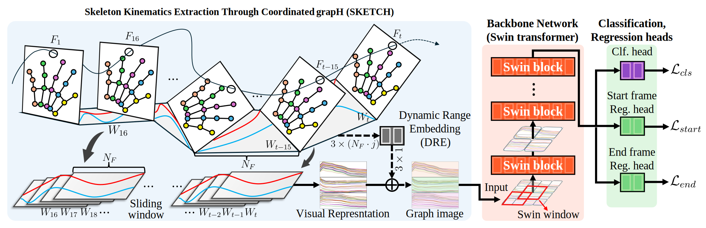

#  SKETCH
This is an official implementation of "Doodle to Detect: A Goofy but Powerful Approach to Skeleton-based Hand Gesture Recognition".

**Doodle to Detect: A Goofy but Powerful Approach to Skeleton-based Hand Gesture Recognition**

<p align="left">
  <a href="#"></a>
  <a href="#"></a>
</p>

<p align="center">
  
</p>
<p align="center"><em>High-level overview of SKETCH.</em></p>

## Table of Contents
- [Features](#features)
- [Installation](#installation)
- [Quick Start](#quick-start)
- [Results](#results)
- [Citation](#citation)
- [License](#license)

## Features
- 🎨 Sketch-inspired idea
- 🧠 Lightweight & fast
- 📈 Consistent gains on benchmarks

## Installation
```bash
git clone https://github.com/<your-username>/SKETCH.git
cd SKETCH

